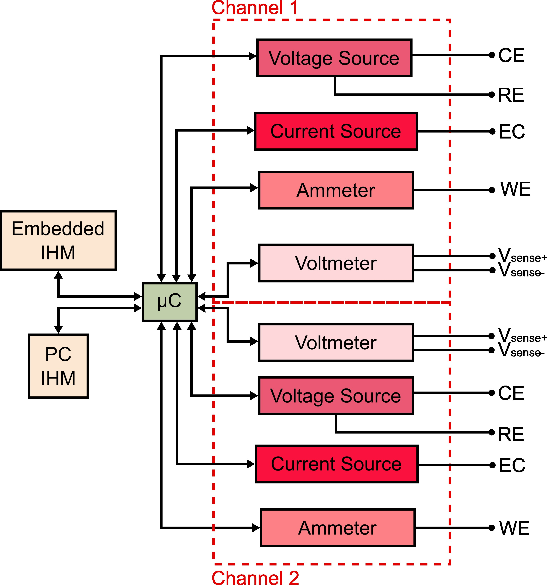
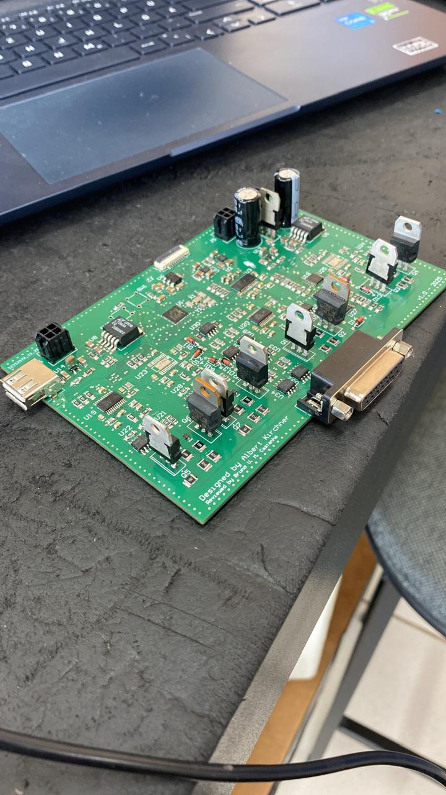
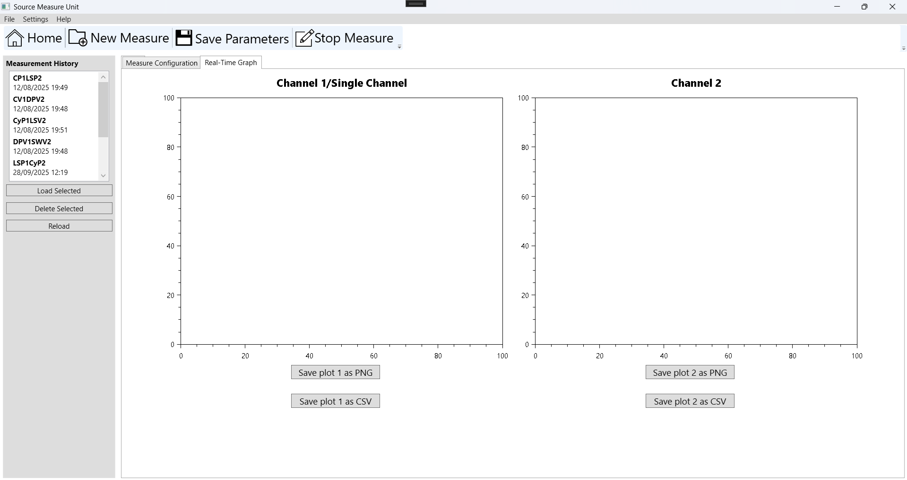
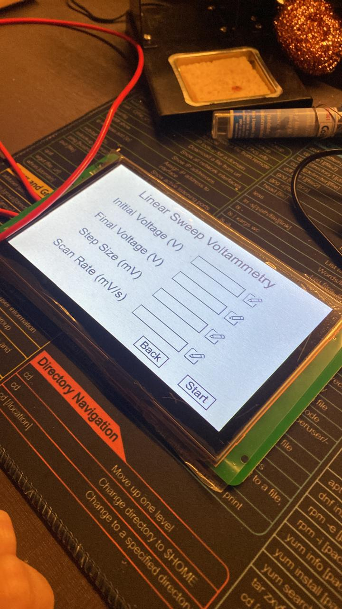

# Low-Cost Dual-Channel SMU

An open-source dual-channel Source Measure Unit (SMU) prototype designed for electrical and electrochemical measurements, developed as a Bachelor's thesis in Electronic Engineering.

The system integrates precision analog hardware, embedded firmware, and graphical user interfaces to provide functionality comparable to commercial SMUs at a significantly lower cost.

## Project Overview

This SMU features two fully independent channels, each capable of operating as a potentiostat or galvanostat, supporting common voltammetric and galvanostatic techniques.  
System control is handled by an STM32 microcontroller, with both embedded (DWIN display) and PC-based (C# / WPF) user interfaces.

> **Project status:** Prototype / Research
> 
> **Project total cost:** USD 410.

---

## Repository Structure

This repository is organized as follows:

```text
.
├── DWIN_display_interface     # Embedded graphical interface (DWIN DGUS project)
├── PCB_Gerber                 # PCB fabrication files used for manufacturing and BOM
├── STM32_firmware             # Embedded firmware running on the STM32 microcontroller
├── Schematics                 # Complete electrical schematics of the SMU
├── Windows_interface          # PC-based user interface (C# / WPF)
├── figures                    # Images used in the README and documentation
├── LICENSE                    # Project license
├── bachelor_thesis_pt-br.pdf  # Bachelor's thesis describing the SMU design and validation (pt-br only)
└── README.md

```

---

## System Architecture

### Functional Block Diagram

<!-- INSERT IMAGE: Overall SMU block diagram -->
<!-- Suggested: block diagram showing Power Supply, Voltage Source, Current Source, Ammeter, Voltmeter, MCU, Interfaces -->


The hardware architecture is divided into five main stages per channel:
- Power supply
- Voltage source
- Current source
- Ammeter
- Voltmeter

### Electrodes

### Potentiostat Mode

In potentiostatic operation, the SMU uses a three-electrode configuration:

- Working Electrode (WE): terminal where the electrochemical reaction occurs. The SMU controls its potential relative to the Reference Electrode and measures the resulting current.
- Counter Electrode (CE): provides the current path required to maintain the controlled potential at the Working Electrode.
- Reference Electrode (RE): used exclusively for voltage sensing, providing a stable reference potential without conducting significant current.

For non-electrochemical measurements, the Counter and Reference electrodes may be connected together, allowing the potentiostat to operate as a voltage buffer.

### Galvanostat Mode

In galvanostatic operation, the SMU applies a controlled current and measures the resulting voltage:

- Current Electrode (EC): injects the defined current into the device or electrochemical cell.
- Voltage Sense (+ / −): measure the voltage response independently of the current path, enabling accurate voltage measurements across the device under test.

---

## Hardware Overview

### Key Components

- **DAC8760** – Precision 16-bit DAC for voltage and current generation  
- **ADS1262** – 32-bit ADC for high-resolution voltage and current measurements  
- **ADG1408** – Analog multiplexer for automatic transimpedance gain selection  
- **STM32F401CCU6** – Central controller and communication hub  
- **DWIN DMG80480C070_04WTC** – Embedded HMI display

### Measurement Capabilities

- Output voltage: **−10 V to +10 V**
- Output current: **−10 mA to +10 mA**
- Voltage resolution: ~**500 µV**
- Current resolution: ~**500 pA**
- Automatic current range switching

### PCB

<!-- INSERT IMAGE: PCB top and bottom views -->
<!-- Suggested: rendered PCB + real board photo -->



The PCB integrates all analog, digital, and power stages, including dedicated connectors for electrodes, power input, USB communication, and the DWIN display.

---

## Firmware Architecture

The firmware is written in C using STM32 HAL and organized into modular libraries:

- **DAC8760** – SPI communication and output control
- **ADS1262** – ADC configuration and data acquisition
- **DWIN** – UART-based display communication
- **SMU** – High-level control, measurement logic, and technique execution

The SMU library acts as the core abstraction layer, managing:
- Channel configuration
- Source and measure operations
- Electrochemical techniques
- Communication with both interfaces

---

## Supported Techniques

### Potentiostatic
- Linear Sweep Voltammetry (LSV)
- Cyclic Voltammetry (CV)
- Differential Pulse Voltammetry (DPV)
- Square Wave Voltammetry (SWV)

### Galvanostatic
- Chronopotentiometry (CP)
- Linear Sweep Potentiometry (LSP)
- Cyclic Potentiometry (CyP)

Both **single-channel** and **synchronous dual-channel** measurements are supported.

---

## User Interfaces

### PC Interface (C# / WPF)

<!-- INSERT IMAGE: PC interface screenshot -->
<!-- Suggested: main window showing real-time plots -->


The PC interface provides:
- Full configuration of measurement parameters
- Real-time plotting
- Dual-channel visualization
- Data export to CSV and PNG
- Measurement history management

Communication is performed via USB-CDC.

### Embedded Interface (DWIN)

<!-- INSERT IMAGE: DWIN display screens -->
<!-- Suggested: menu page + parameter configuration page -->



The embedded interface enables:
- Standalone operation
- Technique selection
- Parameter configuration
- Numeric display of applied and measured values

---

## Future Work

- Automatic ADS1262 PGA gain selection
- Improved averaging and filtering strategies
- PCB layout refinements
- Higher power output stages

---


## Author

Developed by Albert Kirchner

Bachelor Thesis – Electronics Engineering
